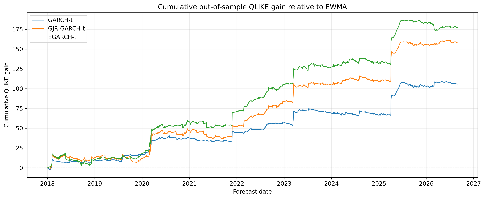

# Forecasting FTSE 100 Volatility: Comparing GARCH, GJR-GARCH and EGARCH

## 1. Introduction

This project examines whether allowing for asymmetric responses to market shocks improves forecasts of daily FTSE 100 volatility. The objective is to forecast the magnitude of return variability rather than the direction of future returns.

The analysis compares three models: GARCH, GJR-GARCH and EGARCH. Standard GARCH allows conditional variance to respond to past squared shocks and past conditional variance, but treats positive and negative shocks of equal magnitude symmetrically. GJR-GARCH and EGARCH allow the response to differ according to the sign of the shock. An exponentially weighted moving average (EWMA) provides a simpler forecasting benchmark.

The initial models are estimated using daily returns from 2000 to 2017. Their forecasting performance is then evaluated over 2,188 trading sessions from January 2018 to August 2026. The baseline GARCH-family models use Student’s t innovations and are re-estimated using an expanding window. Each one-day-ahead forecast uses only information available before the forecast date.

Among the baseline specifications, EGARCH-t records the lowest average QLIKE loss and mean squared error (MSE), reducing MSE by 6.33% relative to EWMA. Its average QLIKE improvement over EWMA and symmetric GARCH is statistically significant in the reported pairwise tests. However, its advantage over GJR-GARCH-t is not statistically significant. Robustness checks examine alternative innovation distributions, estimation windows, evaluation periods and variance proxies.

## 2. Data and Preparation

The analysis uses daily FTSE 100 price data obtained from Yahoo Finance. Before constructing returns, the observations were sorted, checked for duplicate dates and aligned with London Stock Exchange trading sessions. This distinguished genuine gaps in the trading-day record from non-trading-day placeholders.

The data checks identified 54 rows with all price fields missing. Of these, 53 corresponded to non-trading days and were removed. The remaining row, dated 22 December 2020, was a valid trading session and was corrected using historical open, high, low and close prices from Investing.com. A separate calendar check identified a completely absent trading session on 28 May 2012, which was inserted using the same source. These corrections were recorded in a separate audit file.

Daily returns were calculated from consecutive closing prices as:

$$
r_t = 100 \log\left(\frac{P_t}{P_{t-1}}\right),
$$

where \(P_t\) denotes the closing index level on trading day \(t\). Returns are therefore expressed in percentage points, and conditional variance forecasts are expressed in squared percentage points.

The initial training sample contains 4,548 return observations from 2000 to 2017, ending on 29 December 2017. The out-of-sample evaluation contains 2,188 observations from 2 January 2018 to 28 August 2026. During expanding-window forecasting, newly observed returns are added to the estimation sample, but the return on the forecast date is excluded until that date has passed.

Because daily conditional variance is unobserved, forecast accuracy is assessed using observable proxies. The main evaluation uses squared daily returns. Although these provide information about return variability, individual squared returns are noisy measures of the underlying variance.

A robustness check uses the Parkinson high–low variance measure:

$$
v_t^{P}
=
\frac{100^2}{4\log(2)}
\left[\log\left(\frac{H_t}{L_t}\right)\right]^2,
$$

where \(H_t\) and \(L_t\) are the daily high and low index levels. This measure uses the intraday price range but does not capture overnight movements in the same way as close-to-close returns. Results under this proxy are therefore treated as a complementary check. Absolute loss values are not directly compared across the two evaluation targets.

## 3. Models and Forecasting Methodology

### 3.1 Common return specification

The three GARCH-family models use a constant conditional mean:

$$
r_t = \mu + \epsilon_t,
\qquad
\epsilon_t = \sqrt{h_t}z_t,
$$

where \(h_t\) is the conditional variance and \(z_t\) is an innovation with zero mean and unit variance. The baseline specifications use a standardised Student’s t distribution, with its degrees-of-freedom parameter estimated alongside the other model parameters.

### 3.2 GARCH

The GARCH(1,1) model specifies conditional variance as:

$$
h_t = \omega + \alpha\epsilon_{t-1}^{2} + \beta h_{t-1}.
$$

The parameter \(\alpha\) measures the response to the previous squared shock, while \(\beta\) captures the influence of the previous conditional variance. Their sum describes variance persistence. Because shocks enter through their squares, positive and negative shocks of equal magnitude have identical effects.

### 3.3 GJR-GARCH

GJR-GARCH extends this specification with an asymmetric response:

$$
h_t =
\omega
+ \alpha\epsilon_{t-1}^{2}
+ \gamma\epsilon_{t-1}^{2}I(\epsilon_{t-1}<0)
+ \beta h_{t-1},
$$

where \(I(\epsilon_{t-1}<0)\) equals one following a negative shock and zero otherwise. Positive shocks have coefficient \(\alpha\), while negative shocks have coefficient \(\alpha+\gamma\). A positive \(\gamma\) therefore indicates a larger variance response to negative shocks.

Under the symmetric innovation distribution used here, the variance-persistence measure is \(\alpha+\beta+\gamma/2\).

### 3.4 EGARCH

EGARCH models the logarithm of conditional variance:

$$
\log h_t =
\omega
+ \alpha\left(|z_{t-1}|-\sqrt{2/\pi}\right)
+ \gamma z_{t-1}
+ \beta\log h_{t-1}.
$$

This expression follows the parameterisation used by the Python `arch` implementation. The magnitude term captures the response to the size of the standardised shock, while the signed term allows an asymmetric response. A negative \(\gamma\) means that a negative shock raises log variance more than an equally sized positive shock.

Modelling log variance ensures that the resulting variance forecasts are positive. Here, \(\beta\) describes persistence in log variance and is not directly equivalent to the persistence measures reported for GARCH and GJR-GARCH.

### 3.5 EWMA benchmark

The EWMA benchmark uses a zero-mean return specification and a fixed decay factor of 0.94:

$$
h_{t+1|t}
=
0.94h_{t|t-1}
+
0.06r_t^2.
$$

The recursion is initialised using the mean squared return over the first 20 training observations and then updated through the historical sample. Each forecast is recorded before incorporating the return on its target date.

EWMA provides a simple benchmark without daily parameter estimation.

### 3.6 Forecasting procedure

The baseline evaluation uses daily expanding-window estimation. The first forecast, for 2 January 2018, uses returns available through 29 December 2017. For each subsequent forecast date, the estimation sample expands to include the previous trading session.

Each GARCH-family model is re-estimated by maximum likelihood and produces an analytical one-step-ahead conditional variance forecast. The forecast-date return is excluded from estimation. Optimiser convergence and forecast availability are checked, and the models are evaluated on the same 2,188 dates.

This procedure simulates forecasting with information available at each historical date, conditional on the cleaned historical dataset.

### 3.7 Forecast evaluation

Forecasts are evaluated using QLIKE and mean squared error. Let \(v_t\) denote the observed variance proxy and \(\hat h_t\) the variance forecast for date \(t\). The daily losses are:

$$
L_t^{QLIKE}
=
\log(\hat h_t)+\frac{v_t}{\hat h_t},
$$

and

$$
L_t^{MSE}
=
(v_t-\hat h_t)^2.
$$

Lower average loss indicates better forecasting performance. The QLIKE formulation used here remains defined when the squared-return proxy is zero, provided the forecast is positive.

Relative MSE performance is reported as:

$$
\text{MSE reduction (\%)}
=
100\left(
1-\frac{\text{MSE}_{model}}{\text{MSE}_{EWMA}}
\right).
$$

Positive values indicate improvement over EWMA.

Pairwise QLIKE comparisons use daily loss differences, defined as the reference model’s loss minus the comparison model’s loss. Positive average differences favour the comparison model. An intercept-only regression estimates the mean difference, with heteroskedasticity- and autocorrelation-consistent standard errors.

The main results use a HAC lag length of 10, with sensitivity checks at 5 and 20 lags. Reported tests are two-sided, and their p-values are not adjusted for multiple comparisons.

### 3.8 Robustness checks

Four checks assess the sensitivity of the baseline findings:

- Excluding 2020 from forecast evaluation, while retaining it in the historical information available for subsequent forecasts.
- Replacing Student’s t innovations with normal innovations.
- Replacing expanding-window estimation with a rolling window of 1,260 observations.
- Evaluating the forecasts against the Parkinson variance proxy instead of squared returns.

These checks assess whether the main findings depend on a particular period, estimation window, innovation distribution or evaluation target.

## 4. Training-Sample Results

### 4.1 Return characteristics

The training-sample return distribution is more concentrated around its centre and has heavier tails than a normal distribution with the same mean and standard deviation. The normal Q–Q plot also shows substantial departures in both tails. These patterns motivate considering Student’s t innovations, although the unconditional return distribution alone does not establish the appropriate conditional innovation distribution.

Individual return autocorrelations are small, but the Ljung–Box tests reject the joint null of no autocorrelation at lags 5, 10 and 20. Squared returns exhibit much larger and more persistent autocorrelations, consistent with volatility clustering.

ARCH–LM tests strongly reject the null of no ARCH effects at all three lag lengths. Together, these results support modelling time-varying conditional variance.

### 4.2 Parameter estimates and asymmetry

The estimated GARCH model has an ARCH coefficient of approximately 0.1077 and a lagged-variance coefficient of 0.8836. Their sum is 0.9913, indicating highly persistent conditional variance. Although below one, the estimate implies slow adjustment following volatility shocks.

The GJR-GARCH model identifies a substantial difference between the responses to positive and negative shocks. The positive-shock coefficient is effectively zero, while the negative-shock coefficient is approximately 0.1789. The asymmetry coefficient is statistically significant, supporting a larger conditional variance response to negative shocks.

The near-zero positive-shock coefficient does not imply that volatility disappears after positive returns: the intercept and lagged conditional variance continue to contribute. The model’s persistence measure is approximately 0.9839.

EGARCH also identifies a statistically significant asymmetric response. Its signed-shock coefficient is approximately −0.1386, indicating that negative standardised shocks produce a larger log-variance response than equally sized positive shocks. The lagged log-variance coefficient is approximately 0.9830, again indicating substantial persistence.

The positive asymmetry coefficient in GJR-GARCH and negative coefficient in EGARCH therefore describe the same qualitative pattern under different parameterisations. These estimates establish an asymmetric association within the models, rather than identifying its economic cause.

### 4.3 In-sample model fit

All three models converge successfully on the same 4,548 training observations. Table 1 compares their maximised log-likelihoods and information criteria.

**Table 1. Training-sample model comparison**

| Model | Parameters | Log-likelihood | AIC | BIC |
|---|---:|---:|---:|---:|
| GARCH-t | 5 | −6262.343 | 12534.685 | 12566.797 |
| GJR-GARCH-t | 6 | −6177.241 | 12366.483 | 12405.017 |
| EGARCH-t | 6 | −6168.464 | 12348.929 | 12387.463 |

Both asymmetric specifications improve substantially on symmetric GARCH according to AIC and BIC, despite the penalty for their additional parameter. EGARCH-t records the lowest values of both criteria.

These results favour EGARCH-t within the training sample. They do not, by themselves, establish superior forecasting performance, which is assessed separately using the out-of-sample evaluation.

### 4.4 Residual diagnostics

Diagnostics are applied to standardised residuals, calculated by dividing each fitted return innovation by its estimated conditional standard deviation. An adequate specification should remove substantial serial dependence from both these residuals and their squares.

Table 2 reports the diagnostic p-values.

**Table 2. Training-sample standardised residual diagnostics**

| Model | Lag | Ljung–Box: residuals | Ljung–Box: squared residuals | ARCH–LM |
|---|---:|---:|---:|---:|
| GARCH-t | 5 | 0.4783 | 0.4623 | 0.4399 |
| GARCH-t | 10 | 0.8941 | 0.2487 | 0.2502 |
| GARCH-t | 20 | 0.8369 | 0.0431 | 0.0596 |
| GJR-GARCH-t | 5 | 0.3593 | 0.1858 | 0.1776 |
| GJR-GARCH-t | 10 | 0.8187 | 0.1487 | 0.1553 |
| GJR-GARCH-t | 20 | 0.8019 | 0.0420 | 0.0442 |
| EGARCH-t | 5 | 0.2785 | 0.2775 | 0.2593 |
| EGARCH-t | 10 | 0.7309 | 0.2655 | 0.2705 |
| EGARCH-t | 20 | 0.7179 | 0.1485 | 0.1776 |

None of the models shows statistically significant residual autocorrelation at the reported lag lengths using a 5% threshold. However, the squared-residual Ljung–Box tests reject at lag 20 for GARCH-t and GJR-GARCH-t. The GJR-GARCH-t ARCH–LM test also rejects at this lag, while the corresponding GARCH-t result is close to the threshold.

For EGARCH-t, none of the reported tests rejects at the 5% level. Its standardised residual mean is approximately −0.0159 and its variance is approximately 1.0012. These findings suggest that EGARCH-t captures much of the dependence and changing variance present in the original returns.

Non-rejection does not prove that the model is correctly specified or that its innovation distribution is fully adequate. Nevertheless, EGARCH-t combines the strongest information-criterion results with the most satisfactory residual diagnostics among the three specifications.

### 4.5 Fitted conditional volatility

The fitted volatility series show broadly similar movements across the models, including a pronounced peak during the 2008 financial crisis. Differences are more visible around large shocks and during subsequent adjustment.

These fitted paths illustrate the models’ responses within the training sample. The following section evaluates whether their differences translate into more accurate forecasts on observations beyond the initial estimation period.

## 5. Out-of-Sample Forecasting Results

### 5.1 Average forecast accuracy

The baseline evaluation covers 2,188 trading sessions from 2 January 2018 to 28 August 2026. All models produce forecasts for the same dates, with no missing forecasts. Table 3 reports performance against squared daily returns.

**Table 3. Out-of-sample forecast performance**

| Model | Mean QLIKE | MSE | RMSE | QLIKE gain vs EWMA | MSE reduction vs EWMA (%) |
|---|---:|---:|---:|---:|---:|
| EGARCH-t | 0.575760 | 13.916075 | 3.730426 | 0.080996 | 6.33 |
| GJR-GARCH-t | 0.584627 | 14.622742 | 3.823969 | 0.072129 | 1.57 |
| GARCH-t | 0.608455 | 14.519910 | 3.810500 | 0.048301 | 2.27 |
| EWMA | 0.656756 | 14.856511 | 3.854414 | 0.000000 | 0.00 |

EGARCH-t achieves the lowest average loss under both QLIKE and MSE. Relative to EWMA, it reduces MSE by 6.33% and improves average QLIKE by approximately 0.0810.

All three GARCH-family models outperform EWMA on both measures. However, the ranking of GARCH-t and GJR-GARCH-t depends on the loss function. GJR-GARCH-t has lower QLIKE, while symmetric GARCH-t has lower MSE. Allowing for asymmetry therefore does not uniformly improve every accuracy measure, although EGARCH-t ranks first under both.

### 5.2 Statistical comparison of QLIKE losses

Table 4 reports pairwise differences in average QLIKE, with HAC standard errors using 10 lags. A positive gain means that the comparison model has lower average loss than the reference model.

**Table 4. Pairwise QLIKE comparisons**

| Model | Reference | Mean gain | HAC standard error | 95% confidence interval | Two-sided p-value |
|---|---|---:|---:|---|---:|
| GARCH-t | EWMA | 0.048301 | 0.018023 | [0.012976, 0.083625] | 0.0074 |
| GJR-GARCH-t | EWMA | 0.072129 | 0.025336 | [0.022472, 0.121787] | 0.0044 |
| EGARCH-t | EWMA | 0.080996 | 0.024416 | [0.033141, 0.128850] | 0.0009 |
| GJR-GARCH-t | GARCH-t | 0.023829 | 0.011153 | [0.001970, 0.045687] | 0.0326 |
| EGARCH-t | GARCH-t | 0.032695 | 0.012757 | [0.007692, 0.057698] | 0.0104 |
| EGARCH-t | GJR-GARCH-t | 0.008866 | 0.008401 | [−0.007599, 0.025332] | 0.2912 |

At the unadjusted 5% significance level, each GARCH-family model improves on EWMA. Both asymmetric models also improve on symmetric GARCH under QLIKE.

The comparison between EGARCH-t and GJR-GARCH-t is less conclusive. Although EGARCH-t records lower average loss, the confidence interval for the difference includes zero and the p-value is approximately 0.291. The evidence therefore does not establish that EGARCH-t has superior expected QLIKE performance to GJR-GARCH-t.

Using HAC lag lengths of 5 and 20 leaves these significance conclusions unchanged. This provides reassurance that the findings are not driven by the particular choice of 10 lags. However, the reported p-values are unadjusted for multiple comparisons and should be interpreted accordingly. The MSE differences are descriptive; no corresponding significance tests are reported.

### 5.3 Performance over time

The cumulative QLIKE gain plot shows how each model’s advantage over EWMA develops across the evaluation period. An upward movement indicates lower model loss than EWMA on those dates, while a downward movement indicates relative underperformance.

All three models finish with positive cumulative gains. EGARCH-t has the largest total gain, followed by GJR-GARCH-t and GARCH-t. Nevertheless, improvements accumulate unevenly, with pronounced increases around particular episodes in 2020, 2021, 2023 and 2025. There are also periods when gains flatten or decline.

The largest daily EGARCH-t gains occur on dates when the realised squared return is large and EWMA forecasts a substantially lower variance than EGARCH-t. For example, on 4 April 2025, the squared return is approximately 25.7985, compared with forecasts of 0.4381 from EWMA and 0.8126

## 6. Robustness Checks and Limitations

### 6.1 Robustness summary

Table 5 summarises EGARCH performance under alternative evaluation and estimation choices. Each MSE reduction is measured against EWMA on the corresponding dates and variance proxy.

**Table 5. EGARCH robustness summary**

| Specification | Evaluation proxy | Observations | Mean QLIKE | MSE reduction vs EWMA (%) |
|---|---|---:|---:|---:|
| Baseline: expanding window, Student’s t | Squared return | 2,188 | 0.575760 | 6.33 |
| Excluding 2020 from evaluation | Squared return | 1,934 | 0.414968 | 5.23 |
| Normal innovations | Squared return | 2,188 | 0.573401 | 5.98 |
| Rolling window: 1,260 observations | Squared return | 2,188 | 0.582325 | 4.14 |
| Parkinson evaluation proxy | Parkinson | 2,188 | 0.394605 | 30.59 |

The MSE improvement over EWMA remains positive in every specification shown. However, absolute QLIKE values should not be compared directly across different evaluation periods or variance proxies.

### 6.2 Excluding 2020

To assess whether the baseline findings depend entirely on the unusually volatile conditions in 2020, forecast performance is recalculated after excluding that year from evaluation. The forecasts themselves are unchanged, and observations from 2020 remain available for estimating models on subsequent dates.

EGARCH-t retains the lowest QLIKE and MSE among the baseline models on the remaining 1,934 observations. Its MSE reduction relative to EWMA is 5.23%, compared with 6.33% in the full sample. During 2020 alone, the reduction is 6.50%.

The improvement therefore extends beyond 2020, although this check does not establish that performance is uniform across other periods or that gains outside 2020 are statistically significant.

### 6.3 Alternative innovation distributions

Replacing Student’s t innovations with normal innovations produces slightly lower average QLIKE for all three GARCH-family models. EGARCH-Normal achieves a mean QLIKE of 0.573401, compared with 0.575760 for EGARCH-t.

The MSE ranking differs slightly. EGARCH-t retains the lowest MSE among the evaluated normal and Student’s t specifications, reducing MSE relative to EWMA by 6.33%, compared with 5.98% for EGARCH-Normal.

These results suggest that the EGARCH variance specification is more consequential for the observed forecasting advantage than the choice between these two innovation distributions. They do not demonstrate a statistically significant difference between normal and Student’s t forecasts, because no direct inference is reported for that comparison.

### 6.4 Rolling-window estimation

A rolling window of 1,260 observations provides an alternative to retaining the entire available history. This allows older observations to leave the estimation sample as new returns become available.

Rolling-window EGARCH-t continues to outperform EWMA, with mean QLIKE of 0.582325 and an MSE reduction of 4.14%. It also retains the lowest QLIKE and MSE among the three rolling-window GARCH-family models.

However, expanding-window EGARCH-t performs better on both measures over the common evaluation dates. Discarding older observations therefore does not improve EGARCH forecasting accuracy in this exercise. This is a result for the chosen window length and sample, rather than evidence that expanding windows are universally preferable.

### 6.5 Alternative variance proxy

Using the Parkinson high–low measure leaves the model rankings unchanged. EGARCH-t ranks first under both QLIKE and MSE. GJR-GARCH-t ranks second under QLIKE, while GARCH-t ranks second under MSE; EWMA ranks last under both.

EGARCH-t reduces MSE relative to EWMA by 30.59% under this proxy. This percentage should not be interpreted as an increase in accuracy on the original squared-return target. The Parkinson measure represents a different aspect of daily price variation, with different measurement properties and sensitivity to overnight movements.

The unchanged rankings provide complementary evidence in favour of EGARCH within the models examined. However, no pairwise significance tests are reported for the Parkinson evaluation.

### 6.6 Limitations

Several limitations qualify the findings.

First, conditional variance is unobserved. Squared daily returns are noisy proxies, while the Parkinson measure uses intraday ranges and does not capture overnight variation in the same way. Agreement across these targets is useful but does not eliminate measurement uncertainty.

Second, the study examines one equity index and one historical evaluation period. The findings may not generalise to other markets, asset classes or forecast horizons.

Third, cumulative gains are uneven and include substantial contributions from individual large-movement days. Excluding 2020 addresses one important episode but does not establish stability across every market regime.

Fourth, the robustness comparisons are primarily descriptive. Statistical inference is reported for baseline pairwise QLIKE differences, not for every alternative specification or for MSE reductions. The baseline p-values are also unadjusted for multiple testing.

Fifth, the exercise uses a cleaned historical dataset rather than archived data vintages. Forecast construction excludes future returns, but the study does not reproduce the exact data availability and revisions faced by a forecaster in real time.

Finally, forecast-loss improvements do not directly establish economic value. The project does not evaluate portfolio allocation, trading costs, hedging outcomes or risk-measure backtests. Those applications would require additional analysis.

## 7. Conclusion

This project compares GARCH, GJR-GARCH and EGARCH forecasts of daily FTSE 100 variance against an EWMA benchmark. The training data exhibit volatility clustering, heavy unconditional tails and evidence of asymmetric volatility responses. EGARCH-t provides the strongest training-sample information criteria and the most satisfactory residual diagnostics among the specifications examined.

Across 2,188 out-of-sample observations, EGARCH-t achieves the lowest baseline average QLIKE and MSE, reducing MSE by 6.33% relative to EWMA. Its QLIKE improvements over EWMA and symmetric GARCH are statistically significant in the reported unadjusted comparisons. Its smaller advantage over GJR-GARCH-t is not statistically significant.

The broad forecasting advantage survives the exclusion of 2020, the use of normal innovations, rolling-window estimation and evaluation against the Parkinson proxy. These checks support the usefulness of the EGARCH specification in this dataset, while showing that neither Student’s t innovations nor a rolling estimation window is necessary for the improvement.

The evidence therefore favours accounting for asymmetric volatility responses, with EGARCH offering the strongest average performance among the baseline models. The conclusion remains specific to the market, sample, forecast horizon and evaluation methods studied.